# OCBC Express

> An accessibility-first digital banking prototype designed to make everyday banking clearer, safer, and less intimidating for older adults.

OCBC Express is a full-stack web application that reimagines common banking journeys with a simpler mobile-first interface, guided assistance, and fewer barriers to completing essential tasks. Users can sign in, review accounts and cards, transfer money, pay bills, scan QR codes, understand spending, manage budgets, earn rewards, join community discussions, and request help without leaving the experience.

This is an educational prototype built for a Full Stack Development project. It is not an official OCBC product and must not be used for real banking or with real customer data.

## Contents

- [What is it?](#what-is-it)
- [The problem and motivation](#the-problem-and-motivation)
- [Main features](#main-features)
- [Product gallery](#product-gallery)
- [Technology stack](#technology-stack)
- [Architecture](#architecture)
- [Project structure](#project-structure)
- [API overview](#api-overview)
- [Run locally](#run-locally)
- [Contributors](#contributors)
- [Known limitations](#known-limitations)

## What is it?

OCBC Express is a responsive banking web prototype built around the needs of elderly and less digitally confident users. It combines familiar banking capabilities with large touch targets, straightforward labels, guided walkthroughs, voice input, an AI banking assistant, and access to live support.

The frontend consists of mobile-oriented HTML pages with shared CSS and client-side JavaScript. An Express server exposes REST endpoints, controller and model layers contain the application logic, and Microsoft SQL Server stores profiles, accounts, cards, recipients, transactions, bills, forum posts, rewards, and budgets.

## The problem and motivation

Digital banking often assumes that every user is comfortable with dense navigation, technical terminology, multi-step forms, small controls, and self-service troubleshooting. Those assumptions can make routine financial tasks stressful for seniors and first-time digital banking users.

The project explores a practical question: **how can a modern banking app retain useful functionality while becoming easier for elderly users to understand and operate?**

OCBC Express addresses this by:

- presenting high-frequency actions prominently on a simplified home screen;
- using readable typography, spacious cards, recognisable icons, and clear confirmation states;
- providing guided tours for unfamiliar pages and workflows;
- supporting speech-to-text and a conversational assistant;
- offering a path to human help through video calling;
- explaining budgets and spending through visual summaries; and
- keeping transfers, bills, rewards, learning, and support in one consistent experience.

Rather than building only static screens, the team implemented end-to-end flows backed by a relational database and external services. This allows the prototype to demonstrate both the user experience and the full-stack engineering required to support it.

## Main features

### Accessible access and navigation

- Access-code and PIN authentication
- PIN hashing with bcrypt and one-hour JWT sessions
- Mobile-first pages with large, clearly labelled actions
- Intro.js walkthroughs on key screens
- Speech-to-text support

### Accounts and money movement

- Personalised homepage, accounts, balances, currencies, and linked cards
- Searchable/filterable transaction history
- Saved recipients and recipient creation
- Local transfers with purpose/category selection, review, and success states
- Foreign-currency transfers with live conversion and historical rates
- Database transactions and balance checks during money movement

### Payments and financial wellbeing

- QR scan-and-pay using `html5-qrcode`
- Unpaid and paid bill views with confirmation flows
- Expense breakdowns and Chart.js visualisations
- Category budgets and email budget alerts
- AI-generated transaction insights
- Rewards history and claiming

### Help, learning, and community

- AI assistant for intent detection and banking guidance
- Whereby video rooms for live support
- Nodemailer/Mailtrap delivery for support links and alerts
- Service locator with a map-provider token placeholder
- Financial knowledge quizzes
- Discussion categories, posts, message counts, and delete actions

## Product gallery

### Welcome and everyday banking

<table>
  <tr>
    <td align="center" width="33%">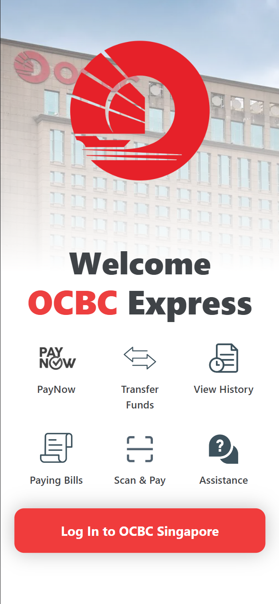<br><strong>Welcome screen</strong><br>Quick access to essential banking services.</td>
    <td align="center" width="33%">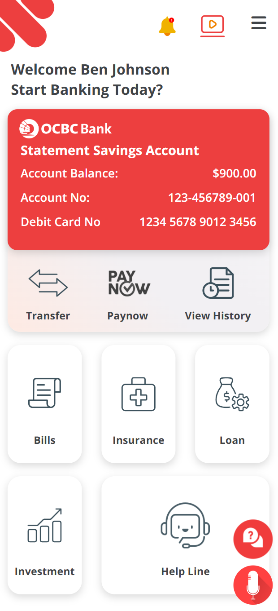<br><strong>Home dashboard</strong><br>Account details and everyday actions in one view.</td>
    <td align="center" width="33%">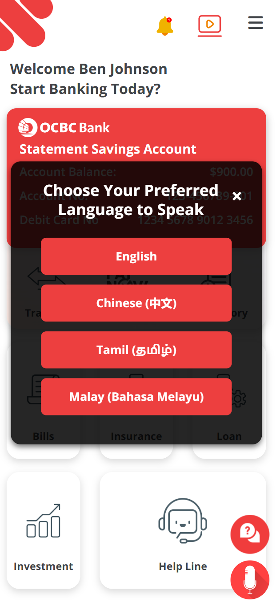<br><strong>Language selection</strong><br>Voice assistance in four supported languages.</td>
  </tr>
</table>

### Guided and assisted banking

<table>
  <tr>
    <td align="center" width="33%">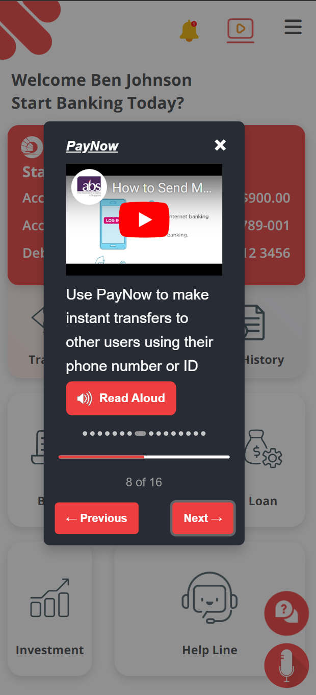<br><strong>Guided walkthrough</strong><br>Step-by-step PayNow guidance with read-aloud support.</td>
    <td align="center" width="33%">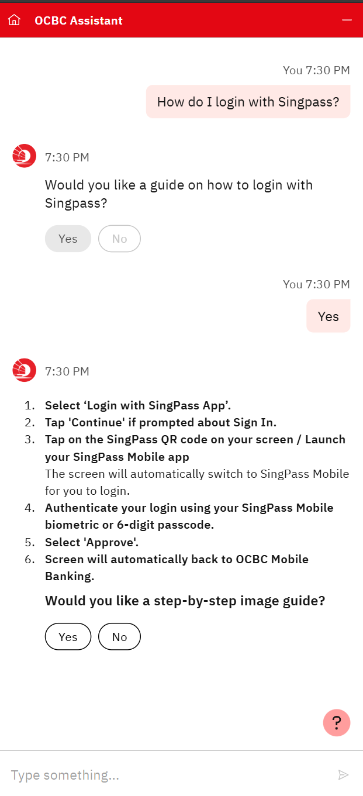<br><strong>AI assistant</strong><br>Conversational help for unfamiliar banking tasks.</td>
    <td align="center" width="33%">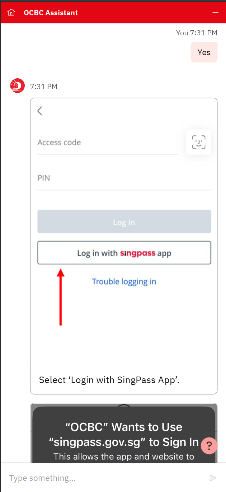<br><strong>Visual instructions</strong><br>Illustrated, step-by-step assistance inside the chat.</td>
  </tr>
</table>

### Transfers and payments

<table>
  <tr>
    <td align="center" width="33%">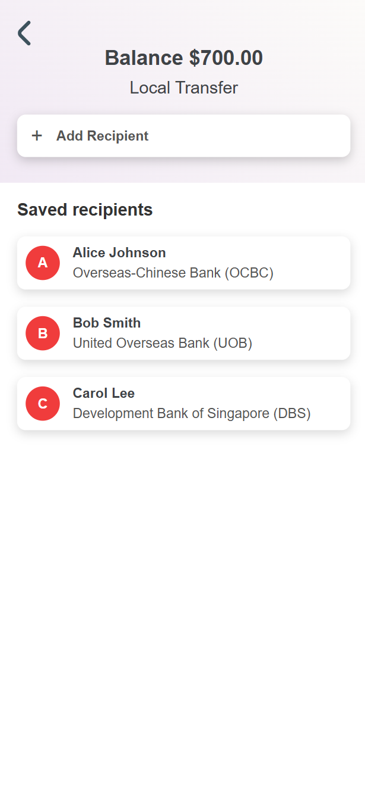<br><strong>Saved recipients</strong><br>Choose an existing recipient or add a new one.</td>
    <td align="center" width="33%">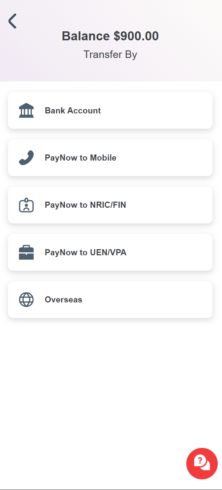<br><strong>Transfer methods</strong><br>Bank account, PayNow, and overseas options.</td>
    <td align="center" width="33%">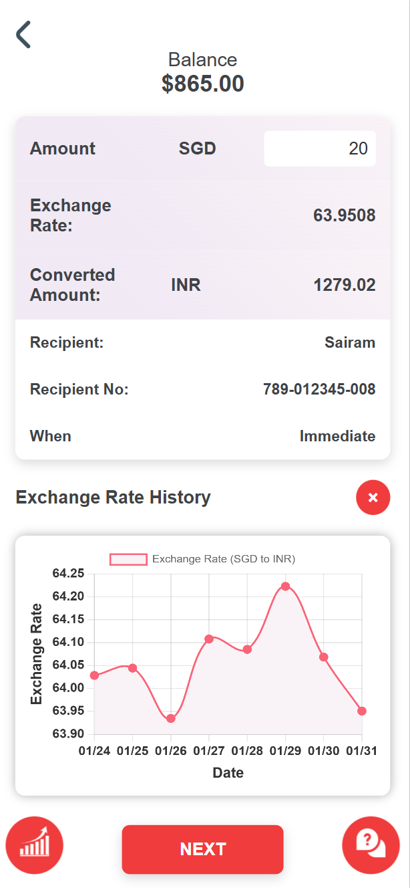<br><strong>Foreign exchange</strong><br>Converted amount and historical exchange-rate chart.</td>
  </tr>
  <tr>
    <td align="center" width="33%">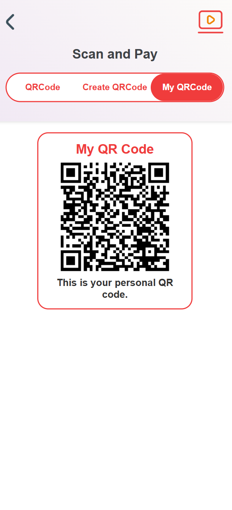<br><strong>Scan and Pay</strong><br>Create, scan, or display a personal payment QR code.</td>
    <td align="center" width="33%">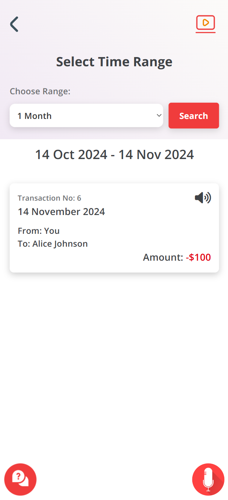<br><strong>Recent activity</strong><br>A focused one-month transaction view.</td>
    <td align="center" width="33%">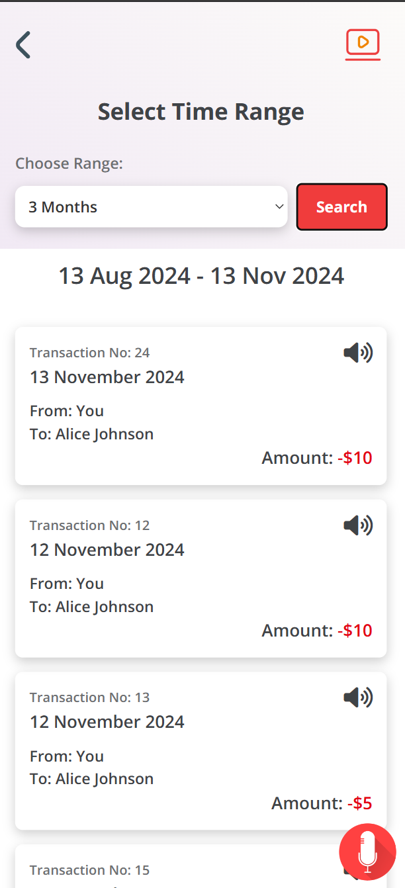<br><strong>Extended history</strong><br>A wider three-month view of account activity.</td>
  </tr>
</table>

### History controls and human support

<table>
  <tr>
    <td align="center" width="50%">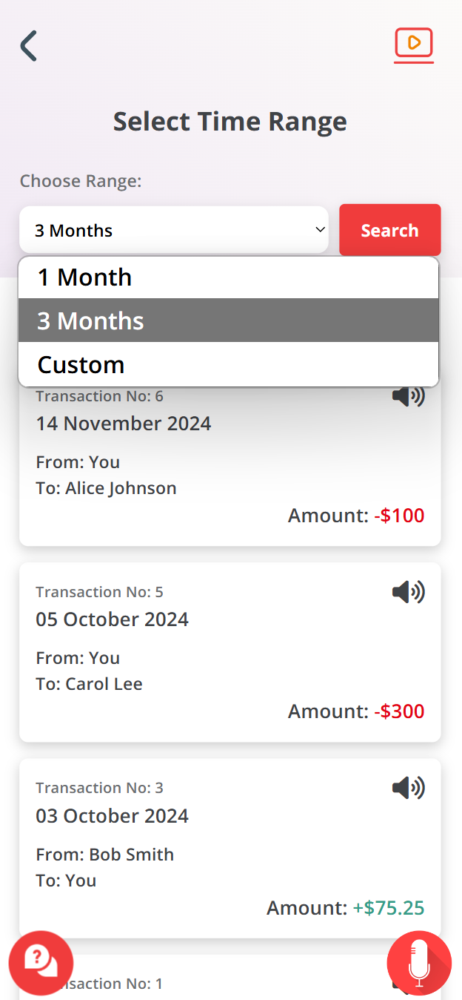<br><strong>Flexible filters</strong><br>Switch between one month, three months, or a custom range.</td>
    <td align="center" width="50%">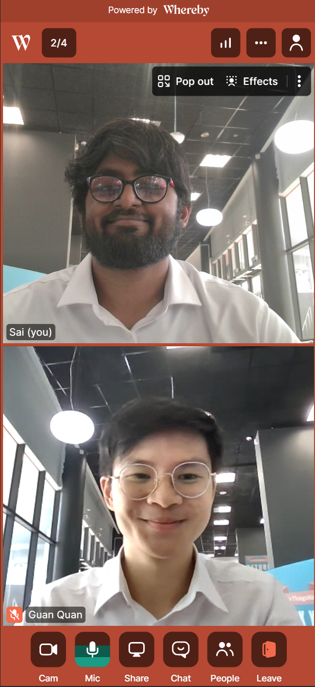<br><strong>Live video support</strong><br>Face-to-face assistance through an embedded Whereby room.</td>
  </tr>
</table>

### Financial insights and community

<table>
  <tr>
    <td align="center">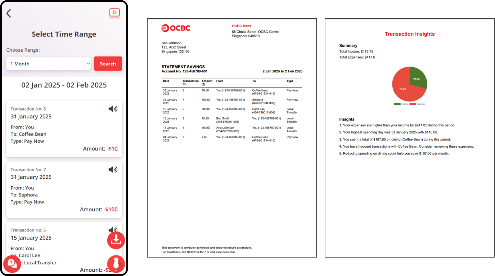<br><strong>Statements and transaction insights</strong><br>Review activity, generate a bank statement, and receive an AI-assisted income and spending summary.</td>
  </tr>
  <tr>
    <td align="center">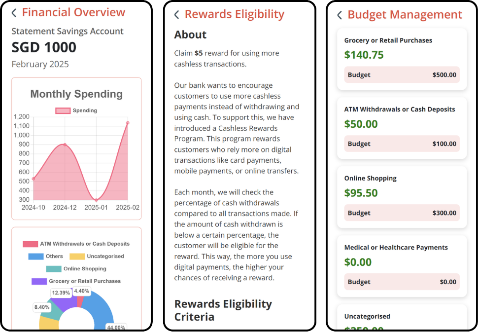<br><strong>Financial wellbeing</strong><br>Understand monthly spending, check reward eligibility, and manage category budgets.</td>
  </tr>
  <tr>
    <td align="center">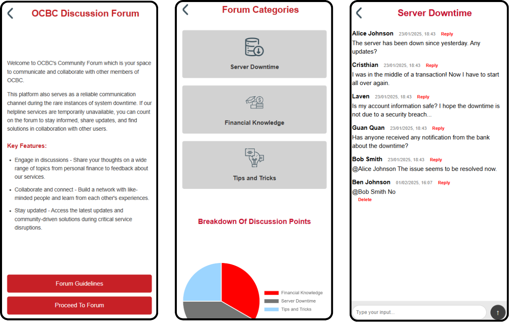<br><strong>Community forum</strong><br>Browse discussion categories, exchange financial knowledge, and receive community updates during service disruptions.</td>
  </tr>
</table>

## Technology stack

| Layer | Technology | Purpose |
| --- | --- | --- |
| Frontend | HTML5, CSS3, JavaScript | Responsive pages and browser interactions |
| UI | Bootstrap 4, Font Awesome, Bootstrap Icons | Layout and visual icons |
| Guidance | Intro.js | In-product walkthroughs |
| Charts | Chart.js | Expense, budget, and forum charts |
| QR | html5-qrcode, jsQR | Scan-and-pay |
| Backend | Node.js, Express | Static hosting and REST API |
| Security | Joi, bcrypt, JSON Web Tokens | Validation, PIN hashing, protected routes |
| Database | Microsoft SQL Server, `mssql` | Relational persistence and transactions |
| AI | OpenAI Chat Completions API | Intent recognition and spending insights |
| Video | Whereby API | On-demand support rooms |
| Email | Nodemailer, Mailtrap SMTP | Support links and budget alerts |
| Currency | exchangeratesapi.io | Conversion and historical rates |

Some pages load Google Fonts, Bootstrap, Font Awesome, and Intro.js from CDNs, so internet access is needed for the complete visual experience.

## Architecture

The backend follows a small Model-View-Controller-style separation. Static HTML acts as the view layer; Express routes delegate to controllers; controllers validate and coordinate work; models execute parameterised SQL queries.

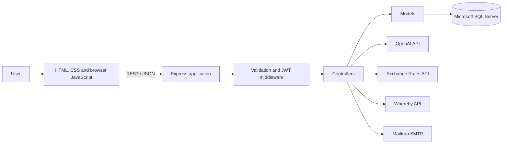

### Request lifecycle

1. The browser loads a page from `public/` and sends a request to Express.
2. Joi validates login input and JWT middleware checks protected requests.
3. A controller extracts request data and invokes a model or integration.
4. The model runs parameterised SQL against `OCBC_DB`.
5. The controller returns JSON, and the page updates or advances the flow.

### Data relationships

- A `Profile` owns accounts and saved recipients.
- An `Account` has cards, transactions, rewards, and budgets.
- A `Profile` receives bills from a `Biller`.
- A bank transaction may have a related foreign-exchange record.
- Forum messages belong to forum categories.

## Project structure

```text
.
├── app.js                    # Express entry point and routes
├── configs/                  # SQL Server and email configuration
├── controllers/              # HTTP handlers and API integrations
├── docs/images/              # README gallery and future screenshots
├── middlewares/              # JWT authentication and Joi validation
├── models/                   # SQL data-access layer
├── public/
│   ├── images/               # Application artwork
│   ├── scripts/              # Browser-side JavaScript
│   ├── styles/               # Shared CSS, Bootstrap, and icons
│   └── */                    # Feature-specific HTML pages
├── Table Creation.sql        # Schema and seed data
├── package.json
└── README.md
```

## API overview

Protected endpoints expect `Authorization: Bearer <token>` unless noted otherwise.

| Area | Method and route | Description |
| --- | --- | --- |
| Auth | `POST /login` | Validate access code/PIN and issue a JWT |
| Profile | `GET /profile/:profileId` | Get profile information |
| Accounts | `GET /account/:profileId` | Get a profile's accounts |
| Cards | `GET /card/:profileId/:accNum` | Get the card linked to an account |
| Transactions | `GET /transactions/:accNum` | Get transaction history |
| Transactions | `GET /transactions/past-month/:accNum` | Get the previous month's history |
| Expenses | `GET /transactions/expenses/:profileId` | Aggregate spending by purpose |
| Recipients | `GET /recipients/:profileId`, `POST /recipients` | List or add recipients |
| Transfers | `POST /transfer`, `POST /foreign-exchange` | Perform local or foreign transfers |
| Rates | `GET /convert-currency`, `GET /historical-rates` | Get conversion and rate data |
| Bills | `GET /unpaid-bills/:profileId`, `GET /paid-bills/:profileId` | List bills by status |
| Bills | `GET /bill/:billID`, `POST /pay-bill/:billID` | Get or pay one bill |
| Budgets | `GET/POST /expense/budget/:accNum` | Read or update budgets |
| Budgets | `POST /expense/budget-alert` | Send a budget alert |
| Rewards | `POST /rewards`, `POST /rewards-claim` | View or claim rewards |
| Forum | `GET /api/forum/categories` | List categories |
| Forum | `GET /api/forum/messages/:categoryId` | List category posts |
| Forum | `POST /api/forum/messages`, `DELETE /api/forum/messages/:messageId` | Create or delete posts |
| AI | `POST /get-intent`, `POST /generate-insights` | Classify requests or create insights |
| Video | `POST /video-calling/create-room` | Create a support room and send an OTP |
| Video | `POST /video-calling/send-host-url` | Email the host URL |

## Run locally

### Prerequisites

- Node.js 18+
- npm
- Microsoft SQL Server with TCP/IP enabled on port `1433`
- SQL Server Management Studio, Azure Data Studio, or another SQL client
- Optional provider credentials for AI, currency, video, and email features

### 1. Clone and install

```bash
git clone <repository-url>
cd Full_Stack_Development_OCBC
npm install
```

The source imports three packages that are not currently declared as direct dependencies. Install compatible CommonJS versions:

```bash
npm install body-parser jsonwebtoken node-fetch@2
```

If bcrypt was installed on another operating system or CPU architecture:

```bash
npm rebuild bcrypt
```

### 2. Configure SQL Server

Update [`configs/dbConfig.js`](configs/dbConfig.js) for your development SQL login, host, database, and port. The checked-in defaults expect `localhost:1433`, database `OCBC_DB`, and user `OCBC_user`. Never commit production credentials.

### 3. Create and seed the database

Run the complete [`Table Creation.sql`](Table%20Creation.sql) file in your SQL client. It creates `OCBC_DB`, recreates project tables, and inserts demonstration data.

> **Warning:** rerunning the script drops existing project tables. Use it only with a disposable development database.

### 4. Add environment variables

Create `.env` in the repository root:

```dotenv
# Required for one-hour authentication tokens
ACCESS_TOKEN_SECRET=replace-with-a-long-random-secret

# Optional integrations; their related features need valid values
OPENAI_API_KEY=
EXCHANGE_API_KEY=
WHEREBY_API_KEY=
YOUR_MAILTRAP_USERNAME=
YOUR_MAILTRAP_PASSWORD=

# Optional; defaults to 3000
PORT=3000
```

Generate a development token secret with `openssl rand -base64 48`. Never expose `.env` values in frontend code or commit them. The service locator has a `YOUR_ACCESS_TOKEN` placeholder in `public/bank-locator/bank-locator.html`; use a restricted browser token for local testing.

### 5. Start the application

The package currently has no `start` script, so launch the entry point directly:

```bash
node app.js
```

After the database connects, open [http://localhost:3000](http://localhost:3000). Stop with `Ctrl+C`; the app closes the SQL connection gracefully.

### Demo data

The SQL script seeds profiles, accounts, cards, transactions, bills, forum content, rewards, and budgets. Its PINs are stored as bcrypt hashes rather than readable credentials. For login testing, generate a hash for a PIN you control and update a development-only profile record.

## Contributors

OCBC Express was designed and developed as a collaborative team project.

| Contributor | GitHub |
| --- | --- |
| Sairam | [@Sa1ram06](https://github.com/Sa1ram06) |
| Laven | [@lavenzx](https://github.com/lavenzx) |
| Kesh | [@Keshyyyyy](https://github.com/Keshyyyyy) |
| Guan Quan | [@Guanquan18](https://github.com/Guanquan18) |
| Andy | [@s0mlain](https://github.com/s0mlain) |

## Known limitations

- This is a classroom prototype, not production banking software.
- SQL credentials are stored in `configs/dbConfig.js`; production systems should use environment variables or a secrets manager.
- Authentication is not applied consistently to every forum, rewards, budget, AI, currency, and video endpoint.
- There is no automated test suite or npm `start` script.
- Several frontend assets require public CDNs.
- External-service features require provider credentials and may incur limits or charges.
- The schema uses floating-point values for money; production financial systems should use fixed-precision decimals.
- The database reset script destructively recreates project tables.
- Full-page screenshots should be captured from a configured local instance with safe demo data.

## Disclaimer

OCBC and associated marks belong to their respective owners. This repository is an independent educational project and is not affiliated with, endorsed by, or connected to Oversea-Chinese Banking Corporation Limited.
